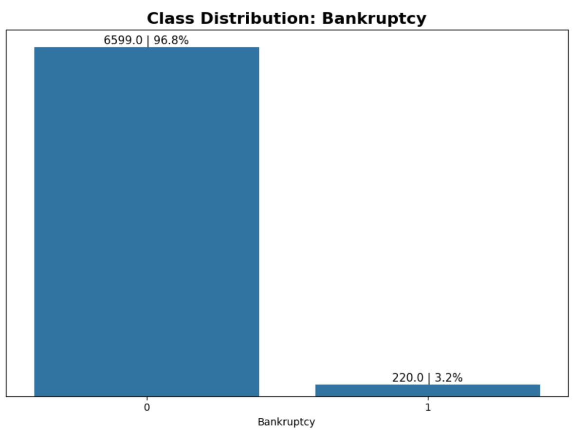
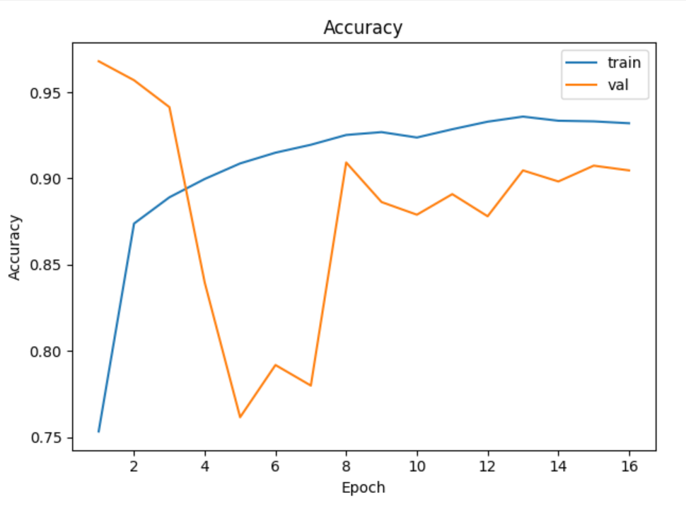

# 📊 Bankruptcy Prediction with Financial Ratios

## 📌 Description

This project focuses on **corporate bankruptcy prediction** using the public dataset **Company Bankruptcy Prediction** from the **UCI Machine Learning Repository**.  
The objective was to train a **Multilayer Perceptron (MLP)** neural network built with **Keras/TensorFlow** to classify companies as **Solvent (0)** or **Bankrupt (1)** based on **financial indicators**.

The study involved:  

- **Exploratory Data Analysis (EDA):** inspection of data types, missing and duplicate counts, and target distribution;  
- **Preprocessing (Pipeline):** log transformation (`log1p`), removal of zero-variance features (**VarianceThreshold**), and feature scaling using **Min-Max Scaler**;  
- **Modeling:** established a **Logistic Regression** baseline (`class_weight='balanced'`) for comparison and trained an **MLP** with a dense architecture and sigmoid output layer;  
- **Training Setup:** included **class weights** (derived from `y_train` distribution), **EarlyStopping** (`patience=10`, `monitor='val_auc'`), and **ReduceLROnPlateau** (`factor=0.5`, `patience=3`).  

---
## 📊 Results

| Model                       | Accuracy | AUC-ROC | F1 (Class 1) |
|------------------------------|:--------:|:-------:|:-------------:|
| Logistic Regression (baseline) | 0.8304 | 0.9496 | 0.2629 |
| **MLP** | **0.9441** | 0.9419 | **0.4602** |

> *Note: The decision threshold was adjusted based on F1 optimization.*

---
## 📌 Conclusion

- The **MLP model**, trained with **class weighting** and **threshold tuning** via validation, **outperformed the baseline** in **F1-score for the positive class**, while maintaining a **high AUC**.  
- Given the **highly imbalanced dataset**, precision for the positive class remains modest, but **recall improvement** makes the model valuable for **early risk detection**.  

- For real-world deployment, it is recommended to:  
  - evaluate the **precision-recall trade-off** according to the cost of false positives/negatives;  
  - enhance **data curation** for positive (bankrupt) samples;  
  - explore **additional techniques** such as anomaly detection or **threshold adjustment** by business segment.  

---

## 📈 Example Visualizations
  

---

💡 *Note:* This project is part of a broader study on financial risk modeling, combining **machine learning**, **data balancing**, and **threshold optimization** techniques for improved predictive performance.  
