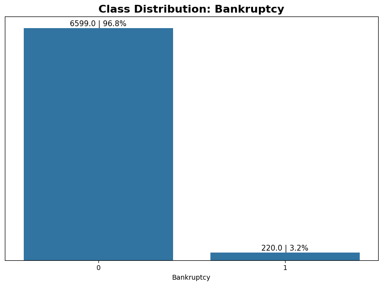
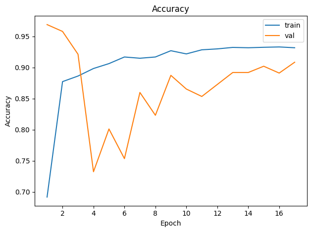
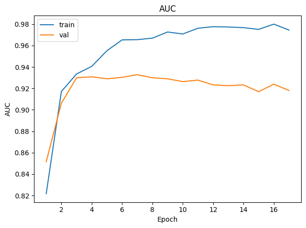
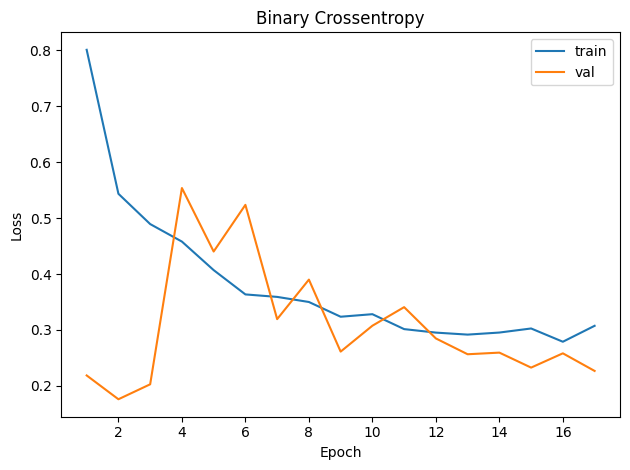
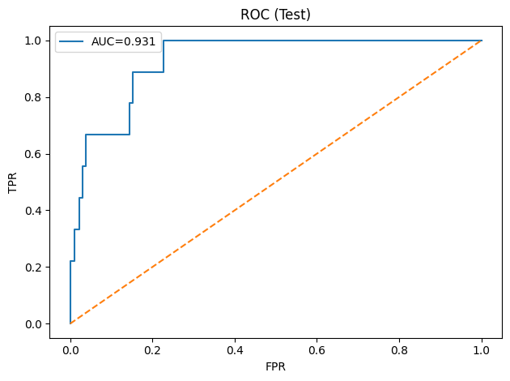

# 🏦 Bankruptcy Risk Prediction

## Project Overview

This project focuses on corporate bankruptcy risk prediction, a key application in finance, credit analysis, and enterprise risk management. Using financial indicators from the Taiwanese Bankruptcy Prediction dataset, the objective is to assess the likelihood of corporate failure while explicitly considering the asymmetric costs of misclassification inherent to bankruptcy events.

Rather than pursuing technical novelty, this work is structured as a practical risk analysis case, prioritizing interpretability, model robustness, and decision relevance to support informed financial judgment.

## Context and Relevance

In financial risk settings, bankruptcy events are infrequent but carry disproportionate impact. Models that appear accurate can still be operationally weak if they fail to detect high-risk cases. This project evaluates bankruptcy prediction as a risk-sensitive classification problem, where results are interpreted through recall, precision trade-offs, and stability on unseen data.

## Key Results

### Baseline: Logistic Regression (Validation)
The baseline is highly sensitive to bankruptcy cases, but produces many false positives.

- Accuracy: **0.8304**
- ROC-AUC: **0.9496**
- Bankruptcy class (1): Precision **0.1528**, Recall **0.9429**, F1 **0.2629**

### Neural Network (Validation with Threshold Tuning)
A decision-threshold search is performed to maximize the minority-class F1 on validation data.

- Best validation threshold: **0.7918** (Best F1(val) ≈ **0.4404**)
- Accuracy: **0.9432**
- ROC-AUC: **0.9327**
- Bankruptcy class (1): Precision **0.3200**, Recall **0.6857**, F1 **0.4364**

### Final Model: Neural Network (Test, Using Validation Threshold)
On unseen test data, the final model maintains strong discrimination and improves minority-class balance compared to the baseline.

- Accuracy: **0.9524**
- ROC-AUC: **0.9306**
- Bankruptcy class (1): Precision **0.3750**, Recall **0.6667**, F1 **0.4800**

## Visual Evidence and Insights

### Class Imbalance

Bankruptcy cases represent a small fraction of observations, reflecting real-world financial data. This explains why accuracy alone is insufficient and motivates recall-focused evaluation.

### Classification Accuracy Over Training Epochs

The accuracy curves show a rapid improvement during the initial epochs, followed by stabilization. Training accuracy steadily increases and converges around 93–94%, while validation accuracy stabilizes slightly lower, around 90–91%.

The gap between training and validation accuracy remains relatively small after the early epochs, indicating good generalization. Although some volatility is observed in validation accuracy during the first epochs, this behavior is expected given the high class imbalance and gradually reduces as training progresses.

### Discriminative Power Across Training Epochs

The Area Under the ROC Curve (AUC) provides a more robust assessment than accuracy for imbalanced datasets such as bankruptcy prediction.

 - Training AUC consistently increases and reaches values close to 0.98, indicating excellent separability on the training set.
 - Validation AUC stabilizes around 0.92–0.93, with only minor fluctuations across epochs.

The divergence between training and validation AUC suggests mild overfitting, but the validation AUC remains strong and stable, confirming that the model preserves its ranking capability on unseen data. In general, the model demonstrates strong discriminatory power, which is critical for financial risk modeling where ranking firms by bankruptcy risk is often more important than raw classification accuracy.

### Model Convergence and Optimization Stability

Both training and validation loss decrease over time, indicating effective optimization.
 - Training loss declines smoothly, reflecting stable learning.
 - Validation loss shows some oscillations, particularly in earlier epochs, but converges to a lower range toward the end of training.

Importantly, validation loss does not diverge upward, which would indicate overfitting. Instead, both curves converge to similar magnitudes. The loss dynamics suggest stable convergence and adequate regularization despite the class imbalance.

### Discriminative Capacity

The ROC curve evaluated on the test set yields an AUC of 0.931, confirming strong out-of-sample performance. The curve remains well above the diagonal (random classifier), showing that the model maintains high true positive rates even at relatively low false positive rates. The model generalizes well to completely unseen data, reinforcing its suitability for real-world bankruptcy risk assessment.

## Conclusions

This study demonstrates that bankruptcy prediction should be approached primarily as a risk management problem, rather than a simple metric-optimization task. Given the highly imbalanced nature of the dataset, traditional performance measures such as accuracy alone are insufficient and potentially misleading. The training and validation curves, together with the class distribution analysis, clearly highlight the importance of evaluation metrics that focus on discriminative capacity, such as AUC and ROC analysis.

The model exhibits stable convergence and consistent generalization across training, validation, and test sets. The strong out-of-sample AUC observed on the test data confirms that the model effectively captures meaningful risk patterns, even in the presence of severe class imbalance. This indicates that the learning process is not driven by majority-class dominance, but rather by the ability to correctly rank firms according to their bankruptcy risk.

Ultimately, the results reinforce that machine learning models in financial distress prediction are most valuable when used as decision-support tools. Rather than replacing expert judgment, such models enhance risk assessment by providing structured, data-driven insights that can inform early warning systems and strategic decision-making processes.

## Language Note

Some files, variable names, and intermediate outputs in this repository are written in Portuguese. This project was developed as a case study presented to a Brazilian client, and therefore the original analysis and documentation followed the client’s local language requirements.

All core modeling steps, evaluation metrics, and final insights are language-agnostic and can be readily interpreted in an international context. Whenever relevant, key results and explanations are provided in English to ensure accessibility for a broader audience.

## Author

Helena de Souza Balbino
